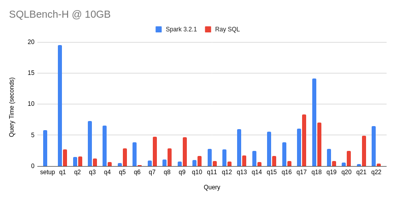

# RaySQL: DataFusion on Ray

This is a personal research project to evaluate performing distributed SQL queries from Python, using
[Ray](https://www.ray.io/) and [DataFusion](https://github.com/apache/arrow-datafusion).

## Example

Run the following example live in your browser using a Google Colab [notebook](https://colab.research.google.com/drive/1tmSX0Lu6UFh58_-DBUVoyYx6BoXHOszP?usp=sharing).

```python
import ray
from raysql.context import RaySqlContext
from raysql.worker import Worker

# Start our cluster
ray.init()

# create some remote Workers
workers = [Worker.remote() for i in range(2)]

# create context and plan a query
ctx = RaySqlContext(workers)
ctx.register_csv('tips', 'tips.csv', True)
result_set = ctx.sql('select sex, smoker, avg(tip/total_bill) as tip_pct from tips group by sex, smoker')
print(result_set)
```

## Status

- RaySQL can run 21 of the 22 TPC-H benchmark queries (query 15 needs DDL and that is not yet supported).

## Features

- Mature SQL support (CTEs, joins, subqueries, etc) thanks to DataFusion
- Support for CSV and Parquet files

## Limitations

- Requires a shared file system currently

## Performance

This chart shows the performance of RaySQL compared to Apache Spark for
[SQLBench-H](https://sqlbenchmarks.io/sqlbench-h/) at a very small data set (10GB), running on my desktop (Threadripper
with 24 physical cores). Both RaySQL and Spark are configured with 24 executors.

Note that query 15 is excluded from both results since RaySQL does not support DDL yet.

### Overall Time

RaySQL is ~30% faster overall for this scale factor and environment.


### Per Query Time

Spark is much faster on some queries, likely due to broadcast exchanges, which RaySQL hasn't implemented yet.



### Performance Plan

I'm planning on experimenting with the following changes to improve performance:

- Make better use of Ray futures to run more tasks in parallel
- Use Ray object store for shuffle data transfer to reduce disk I/O cost
- Keep upgrading to newer versions of DataFusion to pick up the latest optimizations

## Building

```bash
# prepare development environment (used to build wheel / install in development)
python3 -m venv venv
# activate the venv
source venv/bin/activate
# update pip itself if necessary
python -m pip install -U pip
# install dependencies (for Python 3.8+)
python -m pip install -r requirements-in.txt
```

Whenever rust code changes (your changes or via `git pull`):

```bash
# make sure you activate the venv using "source venv/bin/activate" first
maturin develop
python -m pytest
```

## Benchmarking

Create a release build when running benchmarks, then use pip to install the wheel.

```bash
maturin develop --release
```

## How to update dependencies

To change test dependencies, change the `requirements.in` and run

```bash
# install pip-tools (this can be done only once), also consider running in venv
python -m pip install pip-tools
python -m piptools compile --generate-hashes -o requirements-310.txt
```

To update dependencies, run with `-U`

```bash
python -m piptools compile -U --generate-hashes -o requirements-310.txt
```

More details [here](https://github.com/jazzband/pip-tools)
